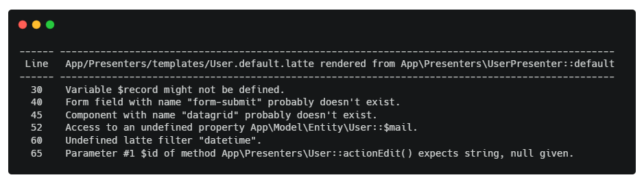

# PHPStan Latte extension
PHPStan extension to check compiled Latte templates in context of a Presenter or a Component etc. Templates are compiled to PHP code which is then analyzed with PHPStan rules according to a configured [rule level](https://phpstan.org/user-guide/rule-levels) and rules from loaded extensions.

The extension is based on Tomas Votruba's [blog series](https://tomasvotruba.com/blog/stamp-static-analysis-of-templates/) and his packages symplify and reveal.



## Features

- Supports Latte 2 and Latte 3
- Templates are analysed in context in which they are rendered (one tempalte can be analysed with different contexts if it is used on multiple places)
- Automatically collects all existing template variables, components, forms, render calls,... from PHP code.
- Analyses existence and parameters of filters.
- Can analyse existence and parameters of links (if you configure `applicationMapping`).
- Can use pre-configured latte engine from your application container (no need to configure manually)
- Analyses existence of components, forms and form fields used in template
- Analyses included templates in context of including template
- Can resolve rendered template path even from more complex expressions (but still has limitations)
- Can report unanalysed templates
- You can use annotations to fine-tuning analysis of latte templates
- If you use some non-standard and magic using rendering you can implement your own template resolvers (experimental)

## Installation
```shell
composer require efabrica/phpstan-latte --dev
```

Add this line to your phpstan.neon:
```neon
includes:
    - vendor/efabrica/phpstan-latte/rules.neon
```

## Configuration

* [Latte engine configuration](docs/configuration.md#latte-engine-configuration)
* [Analyser configuration](docs/configuration.md#analyser-configuration)
* [Ignoring errors](docs/configuration.md#ignoring-errors)
* [Link checking](docs/configuration.md#link-checking)
* [Other configuration options](docs/configuration.md#other-configuration-options)

## Annotations

There are cases that cannot be resolved automatically by static analysis. 

In these cases annotations line `@phpstan-latte-ignore` or `@phpstan-latte-var` could be used to guide resolvers to analyse latte templates correctly.

[How to use annotations](docs/annotations.md)

## Development

[Changelog](CHANGELOG.md)

If you want to contribute your PR are welcomed. If you want to discuss your idea first then create issue.

-----

Thank you for using this package. Let us know if it helped you or what could be improved.
